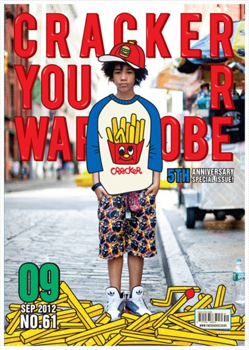

## 나에게 멋진 것.


꿈을 갖게된 고3 한진수는 이과를 선택해 자연스럽게 공대를 준비하고 있었지만

다른 학교도 그렇듯 선생님들이 학생의 동기부여를 위해 대학교가면 여자친구 생긴다던가... 

굉장히 꿀 발린 소리를 늘어놓으셨다.

&nbsp;
 
그 날은 조금 다르게 한 사람, 한 사람에게 본인이 좋아하는 것이 무엇인지 물어보았다.

&nbsp;

그 때 내 머리에 떠오른 
## 패션잡지 'CRACKER'



공부를 하면서도 월초 마다 서점에 들러 구입했던 패션잡지를 떠올리고는

내 차례일 때 선생님에게 옷을 정말 좋아한다고 대답했다. 그러자 친구들이 맞장구를 쳐줬고

그렇게 바로 진로를 결정했고 이과에서 교차지원이 가능했던 몇 안되는 학교에 입학했다.

&nbsp;

꿈 많고 열정 넘쳤던 그때 그 시절

정말 하고싶은 것 다 해봤다고 해도 과언이 아닐지 모르겠다.

큼직한 것만 짧게 요약하자면 길거리 패션 사진도 찍어봤고 가방도 만들어 팔아보고 친구들과 힙합도 했었고 

워킹홀리데이도 다녀왔고 쇼핑몰도 해봤다.

그 중 가장 마지막에 했던 악세사리 쇼핑몰을 준비하며 

카페24를 접하고 HTML/CSS를 알게되었다.

&nbsp;

## 코딩?!


처음엔 내가 만든 디자인을 그저 표현하고 싶었던 이유로 공부를 시작했는데

공부가 길어지다보니 어느덧 졸업까지 1년 남짓 남아 진로를 고민 하던 끝에 디블리셔(디자인+퍼블리셔)를 꿈꾸며

웹 퍼블리셔 학원을 6개월 정도 학교와 병행하며 다녔다 (그 당시 코로나 덕분에(?) 비대면 수업을 진행해 가능했다.)

&nbsp;

그러다 운 좋게 마지막 학기에 수업대신 웹 퍼블리셔로 현장실습할 수 있는 기회가 생겨서 그대로 진행했다.

그렇게 그곳에서 그대로 취업하고 일을 하며 퍼블리셔라는 직업의 모호성을 느끼며 그만두고

지금은 현재 프론트엔드를 꿈꾸는 상태...

&nbsp;

많이 돌아온 걸 수도 있지만 난 그때 그때 항상 매사에 열심히 했고 

앞으로도 그럴 것이라는 건 확신하고 있다.

그리고 무엇보다 이 일이 재밌다. 디자인도 재밌지만... 정답이 모호하고 해석하기 나름인 영역보단 

확실히 수학처럼 정답이 정해져있는 영역이 파헤지기 즐겁다.

어릴적 이과적 성향이 여기서 드러나나보다.

&nbsp;

오늘은 내 얘기를 한 번 해봤는데 앞으로는 기술블로그로써 내 기술적 고민과 내가 좋아하는 것들을 3:1 비율로 적어보는 시간을 갖도록 하겠다.

그럼

읽어주셔서 감사합니다🙇

```toc
```